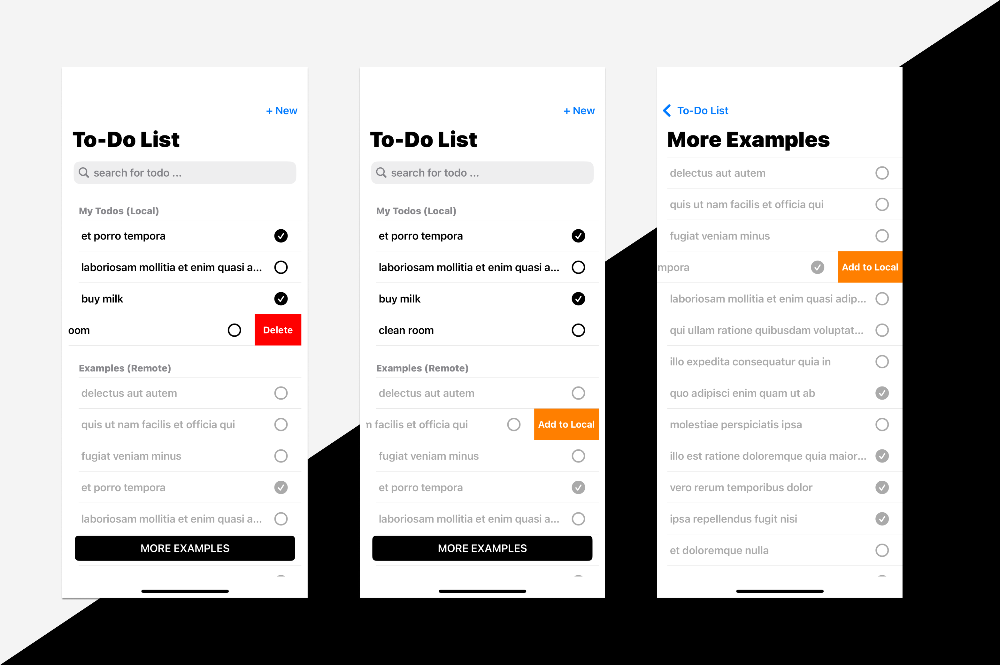

# Simple To-Do List App

A lightweight, efficient to-do list application designed with a modular and scalable architecture. 

## Screenshots

## Features
- [X] Add, delete, and mark tasks as completed
- [X] Persist tasks locally using Core Data
- [X] Fetch placeholder tasks from a remote API
- [X] Add example tasks from Remote task list to your local task list
- [X] Search functionality across both local and remote task lists

## Architecture & Design Decisions

### MVVM with Input & Output Protocols
- Separates the view logic from the business logic, ensuring a clean, testable codebase.
- The input/output protocols define data flow and actions, making the ViewModel reusable and decoupled from the View.

### UIKit (Nib Files Only)
- Utilizes UIKit with nib files for UI layout, avoiding storyboard dependencies for better code organization and control over views.

### Coordinator Pattern (Navigation)
- Manages navigation flows to maintain a separation of concerns.
- Keeps view controllers lean by centralizing navigation logic.

### Repository Pattern (Data Source)
- Manages data access, bridging the gap between the local (Core Data) and remote (API) data sources.
- Provides a unified interface for data handling, ensuring flexibility and scalability.

### Singleton Network & Core Data Managers
- Network Manager: A generic, reusable singleton to manage API calls using `URLSession`.
- Core Data Manager: Handles persistent storage, ensuring data consistency across the app.

## Tech Stack
- **Combine** for reactive programming, handling async data flow.
- **Core Data** for local storage and persistence.
- **URLSession** for API calls, integrated with the Network Manager.
  
This modular approach enhances scalability and simplifies testing, making the app easily extensible for future features.
